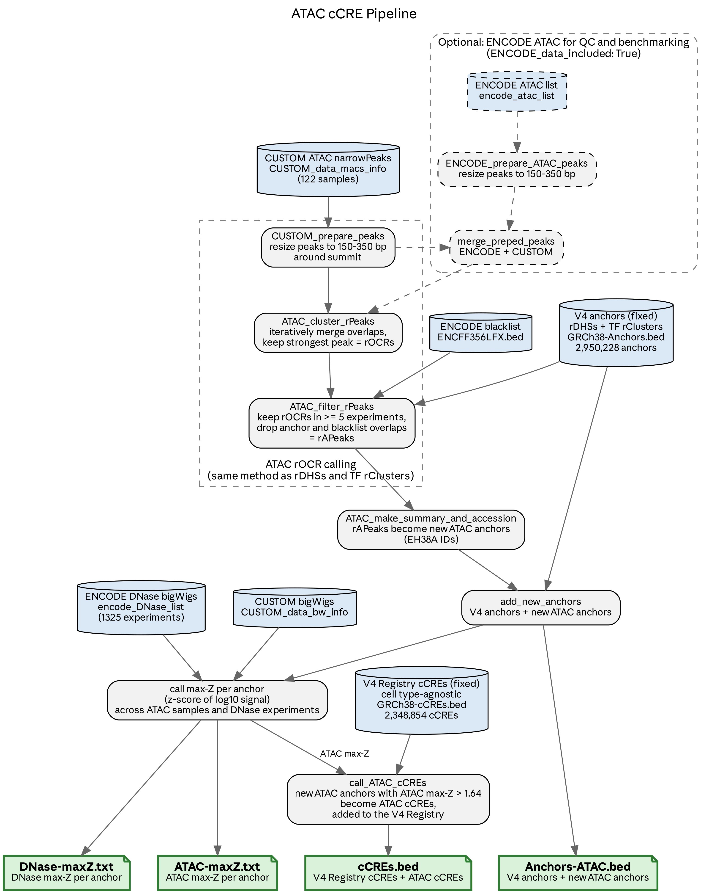

# ccre-pipeline-smk

Snakemake pipeline that calls ATAC cCREs. It clusters ATAC narrowPeaks into rPeaks, keeps the ones
that aren't already registry rDHSs, adds them to the rDHS anchors, and z-scores every anchor in
every ATAC and DNase bigWig. An ATAC anchor with max z-score above 1.64 becomes an ATAC cCRE.



The layout and rule conventions follow `~/Projects/snakemake-template`.

## Run

`environment.yaml` has the Snakemake driver. Rules get their tools from `workflow/envs/env.yaml`
through `--use-conda`, which the profiles set.

```sh
mamba env create -f environment.yaml
mamba activate ccre-pipeline
cp config/config.yaml.template config/config.yaml  # then edit
cp config/samples.example.tsv config/samples.tsv   # then edit
snakemake -n -p --profile profiles/local           # dry run
snakemake --profile profiles/local                 # local
snakemake --profile profiles/slurm                 # SLURM
```

Outputs land in `results/<run_id>/`. Logs and benchmarks mirror it under `logs/<run_id>/` and
`benchmarks/<run_id>/`.

| File | Contents |
|---|---|
| `Anchors-ATAC.bed` | registry rDHS anchors plus the new ATAC anchors (`EH38A...`) |
| `ATAC-maxZ.txt` | per-anchor max z-score over the sample bigWigs |
| `DNase-maxZ.txt` | per-anchor max z-score over the ENCODE DNase bigWigs; skipped if `dnase: null` |
| `cCREs.bed` | registry cCREs plus ATAC cCREs, with accessions |

Intermediates sit under `peaks/`, `rpeaks/`, `zscore/` and `fragments/`.

## Samples

`config['samples']` is one TSV or a list of TSVs. The pipeline concatenates their rows, so a run
over ENCODE and custom samples lists both sheets.

| Column | |
|---|---|
| `sample_id` | unique; letters, digits, `_ . + -` |
| `narrowpeak`, `bigwig` | MACS narrowPeak and fold-enrichment bigWig |
| `biosample` | optional; defaults to `sample_id` |
| `fragments`, `fragment_format` | optional, in place of narrowpeak and bigwig. MACS3 calls peaks and builds the bigWig. Format is `FRAG` (default) or `BEDPE`. |

## Reference files

Not tracked in git. Place in `resources/`. MD5 checksums were verified against the sources on
2026-09-24.

`GRCh38-cCREs.bed` is the V7 `hg38-cCREs-Unfiltered.bed`, not `hg38-cCREs-Total.bed`.

| File | Source | MD5 |
|---|---|---|
| `GRCh38-cCREs.bed` | `/data/zusers/moorej3/moorej.ghpcc.project/ENCODE/Encyclopedia/V7/Registry/V7-hg38/hg38-cCREs-Unfiltered.bed` | `60c14d9f4903a7bd13b3db4f290ace48` |
| `GRCh38-Anchors.bed` | `/data/zusers/moorej3/moorej.ghpcc.project/ENCODE/Encyclopedia/V7/Registry/V7-hg38/hg38-Anchors.bed` | `9c5d57a3de8f09b27e9c00661801eddb` |

```sh
D=/data/zusers/moorej3/moorej.ghpcc.project/ENCODE/Encyclopedia/V7/Registry/V7-hg38
cp $D/hg38-cCREs-Unfiltered.bed resources/GRCh38-cCREs.bed
cp $D/hg38-Anchors.bed resources/GRCh38-Anchors.bed
```

The blacklist (`ENCFF356LFX.bed`) and chrom sizes are read in place; see `references` in the
config template.

## Input data

Not copied. Read in place.

- Custom ATAC narrowPeaks and bigWigs: `/zata/data/zlab/zusers/campbellm/t1d/`
- ENCODE peaks: `/data/projects/encode/data`. ENCODE bigWigs: `/zata/data/zlab/projects/encode/data`.

## Preflight scripts

Run once, outside the pipeline. They write sample sheets the pipeline reads.

### `workflow/scripts/encode_atac_samples.py`

Selects ENCODE ATAC-seq samples from an [encode-metadata](../encode-metadata-smk) snapshot. It
replaces the original pipeline's live ENCODE API pull.

- Experiments: released, unperturbed *Homo sapiens* ATAC-seq.
- Peak: the released GRCh38 `preferred_default` narrowPeak.
- BigWig: the released GRCh38 fold-change bigWig from the experiment's `default_analysis` that
  covers the most replicates (the pooled track).
- Filters: FRiP of the peak file `>= 0.2`. `--min-reads` (usable fragments) is off by default.
- Fails if a chosen file is missing from the local ENCODE mirror.

```sh
S=~/Projects/encode-metadata-smk/results/2026-09-23/parquets
python workflow/scripts/encode_atac_samples.py $S \
    --output resources/encode-atac.2026-09-23.tsv \
    --legacy-output resources/encode-atac.2026-09-23.legacy.txt
```

Outputs, both tracked in git:

| File | Contents |
|---|---|
| `resources/encode-atac.2026-09-23.tsv` | sample sheet: `sample_id`, `narrowpeak`, `bigwig`, `biosample` |
| `resources/encode-atac.2026-09-23.legacy.txt` | headerless experiment, peak, bigWig, biosample; the list the original pipeline reads |

The 2026-09-23 snapshot gives 273 of 369 experiments. That's the same set and peak files as the
May 2026 API pull.

### Custom sample sheet

The 2026-08-25 custom lists
(`resources/CUSTOM_ATAC_List_{bw,narrowpeaks}_2026-08-25_0.2_25000000_orbonus_50per.txt`, copied
from `/zata/zippy/campbellm/snakemake_atac_ccres/resources/`, not tracked) become one sheet:

```sh
N=resources/CUSTOM_ATAC_List_narrowpeaks_2026-08-25_0.2_25000000_orbonus_50per.txt
B=resources/CUSTOM_ATAC_List_bw_2026-08-25_0.2_25000000_orbonus_50per.txt
{ printf 'sample_id\tnarrowpeak\tbigwig\n'
  awk -F'\t' 'BEGIN{OFS="\t"} NR==FNR{bw[$1]=$2; next} FNR>1{print $1, $2, bw[$1]}' $B $N
} > config/samples-custom-2026-08-25.tsv
```

## Parity with the original pipeline

`parity/` checks this workflow against runs of the colleague's original code (tag `baseline`).

- `parity/configs/{custom,encode,merged}.yaml`: the three source modes.
- `parity/compare.py GOLDEN NEW -m parity/refactor.tsv --prefix CUSTOM`: file-by-file comparison.
  BEDs must be byte-identical, z-scores numerically equal. `;`-joined set columns are compared as
  sets, because the original joined them in hash order.
- `parity/dryrun.sh`: normalized forced dry run, for diffing two versions' commands.

Golden runs:

| Mode | Directory |
|---|---|
| CUSTOM | `/zata/zippy/campbellm/snakemake_atac_ccres/BETA_islet_CUSTOM_ATAC_List_bw_2026-08-25/` |
| ENCODE | `/zata/zippy/ramirezc/ccre-golden/encode/` (branch `golden-encode`) |
| MERGED | `/zata/zippy/ramirezc/ccre-golden/merged/` (branch `golden-encode`) |
